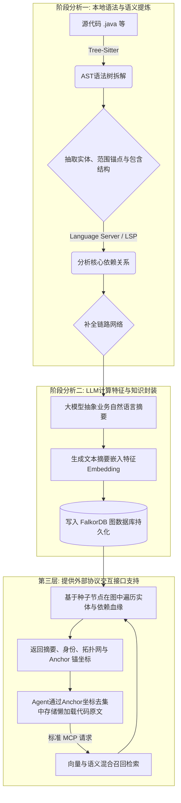

# 系统架构与工作流概览

本文档旨在提供对 Rigel 核心工作流与架构设计的宏观概述，便于开发人员从整体视角理解系统的实现机理与抽象实体定义。关于严谨的数据库实体、关系及接口规范限制，请参阅 `docs/design` 目录下的详细指导记录。

> [!IMPORTANT]
> 项目各项架构抽象与规划随时可能发生变动。**在整个项目中，只有被正式写入 `docs/adr/` 架构决策记录下的决议才几乎不会发生变动**，其余指南内容仅反映当前阶段的最佳实践并且可能滞后。

---

## 系统背景与问题陈述

在现有的 AI 研发辅助场景中，直接将超文本片段交付大语言模型处理，常导致模型对包层级与模块间调用的结构性解析出现偏差。

**Rigel 的核心机制与职责所在：** 解析、归纳并持久化实体节点之间的代码依赖及层级网络。建立面向 AI 特化、具备严格引用可溯源性的索引结构并对外响应查询服务。

## 核心实现机制

在系统内部流转中，各项功能被解耦为阶段性的处理单元，整体上构成了“抽取 => 增补与持久化 => 外部代理服务代理”的三阶段架构运转形态。

---

## 核心模型与图设计语义解释

系统将其面对的高复杂度底层代码形态映射到图数据库的核心逻辑表现中，包含两类核心图解组件——**实体节点 (Node)** 与 **关系边 (Edge)**。

### 系统支持的核心实体节点

系统共抽象并定义了六类粗粒度核心节点，旨在提供符合 Agent 宏观认知的语义聚合：
1. **基础设施节点**：如 `Repository`，标识代码库。
2. **物理结构节点**：如 `Module`（单体仓库边界）与 `File`（文件级载体与哈希）。
3. **核心语义节点**：`Entity`，囊括类、函数、接口、全局变量等真正的语义实体。
4. **辅助元数据节点**：包含 `Anchor`（记录代码具体范围，用于后续懒加载原文）与 `Summary`（自然语言摘要，作为第一检索表面）。

### 核心关联引用的表现形态

连接上述节点的数据流转边网络收敛为六大核心关系族，特定语言的细节通过边的 `kind` 属性进行下钻：
- **结构包含**：`CONTAINS` 表达所有层级结构（库 -> 模块 -> 文件 -> 语义实体内部扩展）。
- **物理映射**：`HAS_ANCHOR` 连接语义节点与其在源代码中的具象范围标定。
- **语义依赖**：`DEPENDS_ON` 覆盖调用、导入、类型引用等关系（通过属性区分功能）。
- **特化与派生**：`SPECIALIZES` 处理面向对象的继承与接口重写。
- **等价镜像**：`ALIASES` 处理别名与重导出映射。
- **检索入口**：`DESCRIBES` 将生成的摘要附着到关联的语义网络上。

> [!TIP]
> 上述设计避免了细粒度 AST 图引发的庞大存储负担与心智消耗。当需要分析源码时，系统可通过向量命中 Summary 节点进入图网络，直接利用粗粒度的宏观拓扑反向递归关系并输出结构链条。随后借助提取到的 Anchor 懒加载必要的原文发送给 Agent，极大地减少了传递给底层模型的冗余字符串负荷并避免了业务幻觉。
