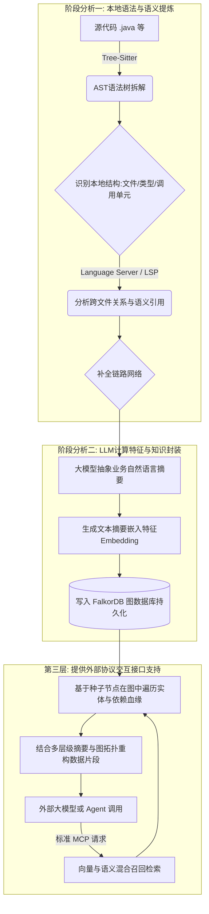

# 系统架构与工作流概览

本文档旨在提供对 Rigel 核心工作流与架构设计的宏观概述，便于开发人员从整体视角理解系统的实现机理与抽象实体定义。关于严谨的数据库实体、关系及接口规范限制，请参阅 `docs/design` 目录下的详细指导记录。

> [!IMPORTANT]
> 项目各项架构抽象与规划随时可能发生变动。**在整个项目中，只有被正式写入 `docs/adr/` 架构决策记录下的决议才几乎不会发生变动**，其余指南内容仅反映当前阶段的最佳实践并且可能滞后。

---

## 系统背景与问题陈述

在现有的 AI 研发辅助场景中，直接将超文本片段交付大语言模型处理，常导致模型对包层级与模块间调用的结构性解析出现偏差。

**Rigel 的核心机制与职责所在：** 解析、归纳并持久化实体节点之间的代码依赖及层级网络。建立面向 AI 特化、具备严格引用可溯源性的索引结构并对外响应查询服务。

## 核心实现机制

在系统内部流转中，各项功能被解耦为阶段性的处理单元，整体上构成了“抽取 => 增补与持久化 => 外部代理服务代理”的三阶段架构运转形态。

---

## 核心模型与图设计语义解释

系统将其面对的高复杂度底层代码形态映射到图数据库的核心逻辑表现中，包含两类核心图解组件——**实体节点 (Node)** 与 **关系边 (Edge)**。

### 系统支持的核心实体节点

系统共抽象并定义了三种维度的节点：
1. `file`: 处理源码的文件级载体信息，主要记录工程绝对及相对定位与元信息。
2. `type`: 处理类型定义域信息。囊括 `class`、`interface` 与枚举等结构数据。
3. `callable`: 处理原子级的可执行封装体信息。覆盖各类方法 (`Method`) 以及构造器 (`Constructor`) 单元。

### 核心关联引用的表现形态

连接上述三种节点的数据流转边网络抽象有五种不同类目：
- **组织结构属性关系：** 
  - `defines`: 表征包含与定义的关系（即父子层级映射）例如一个源文件关联类，该类关联所属方法。
- **运行及声明逻辑关系：**
  - `calls`: 表征主调函数实体对被调函数实体的直接引用与调用关联。
  - `extends` / `implements`: 表征继承机制或是接口契约的实现联系。由于此类抽象仅能定义在结构域级别，通常绑定在 `type` 与 `type` 的节点上。
  - `imports`: 表征文件内或跨文件对特定第三方、自有 `type` 或 `callable` 元素的导入依赖。

> [!TIP]
> 上述设计避免了传统依赖全量文件分析或文本关键字匹配的固有缺陷。当需要分析变更范围或调用溯源时，系统可通过检索核心函数节点直接利用 `calls` 反向递归关系路径输出完整的结构链条，从而极大的减少传递给底层模型的冗余推理消耗并最大程度避免大模型输出时的业务幻觉。
